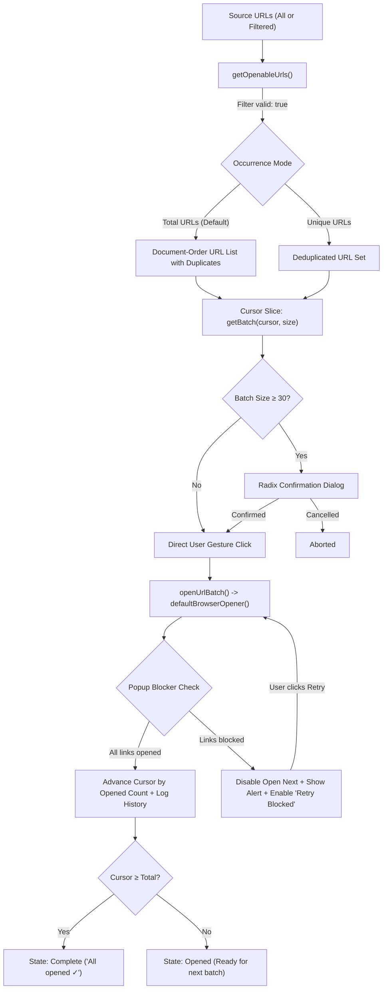
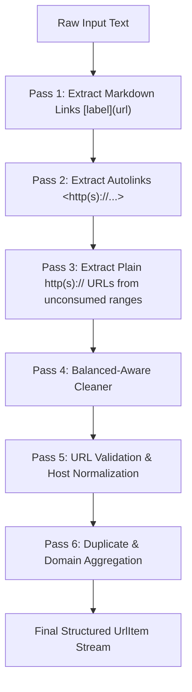

<div align="center">

# 🔗 Linkcount

### Paste links. See what is actually there.

A blazing-fast, privacy-first URL inspector, counter, filter, batch opener, shortener, and exporter.<br/>
Accurately dissects complex pasted text and Markdown without ever mutating your source list.

[](https://react.dev/)
[](https://www.typescriptlang.org/)
[](https://vite.dev/)
[](https://tailwindcss.com/)
[](https://vitest.dev/)
[](https://www.radix-ui.com/)
[](https://motion.dev/)

[✨ Key Features](#-key-features) •
[🚀 Batch Link Opener](#-batch-link-opener) •
[🛡️ Hardened Popup Detection & Recovery](#️-hardened-popup-detection--recovery) •
[📑 Tab Groups & Progressive Enhancement](#-tab-groups--progressive-enhancement) •
[🔄 Parser Pipeline](#-parser-pipeline) •
[⚡ URL Shortener](#-multi-provider-url-shortener) •
[📱 Mobile & Tablet First](#-mobile--tablet-first) •
[🛠️ Tech Stack](#️-tech-stack) •
[📁 Project Structure](#-project-structure) •
[🇹🇭 สรุปภาษาไทย](#-สรุปภาษาไทย)

</div>

---

## 🖥️ Preview & Interface

```text
┌──────────────────────────────────────────────────────────────────────────────────┐
│  🔗 Linkcount    URL utility, without the clutter           [ ☀️ / 🌙 ] [ GitHub ]│
├──────────────────────────────────────────────────────────────────────────────────┤
│                                                                                  │
│   Analyze URLs                                                                   │
│   Paste links. See what is actually there.                                       │
│                                                                                  │
│  ┌──────────────────────────────────────────────┐  ┌──────────────────────────┐  │
│  │ URLs or text containing URLs                 │  │ TOTAL URLS            73 │  │
│  │                                              │  ├──────────────────────────┤  │
│  │  https://github.com/kainapat/url-link-counter│  │ UNIQUE                71 │  │
│  │  [Documentation](https://vite.dev/guide/)    │  ├──────────────────────────┤  │
│  │  Check out: <https://tailwindcss.com>        │  │ DUPLICATES             2 │  │
│  │                                              │  ├──────────────────────────┤  │
│  │                                              │  │ DOMAINS               18 │  │
│  │                                              │  ├──────────────────────────┤  │
│  │ [Clear]        Duplicate links are badged.   │  │ INVALID                0 │  │
│  └──────────────────────────────────────────────┘  └──────────────────────────┘  │
│                                                                                  │
│  ┌─ Domains ──────────────────────────────────────────────────────────────────┐  │
│  │  github.com (24)  •  vite.dev (12)  •  tailwindcss.com (8)   [Show all...] │  │
│  └────────────────────────────────────────────────────────────────────────────┘  │
│                                                                                  │
│  ┌─ Results (73 links) ─ [ Mode: Total URLs | Unique ] ─ [ Search... ] [All ▾] ─┐  │
│  │  [📋 Copy all]  [📥 TXT]  [📊 CSV]  [✂️ Shorten all]  [📋 Copy shortened (73)] │  │
│  ├────────────────────────────────────────────────────────────────────────────┤  │
│  │  OPEN LINKS IN BATCH                             [ Batch 2 of 8 ]          │  │
│  │                                                                            │  │
│  │  Open per batch: [ 10 links ▼ ]   Scope: [ Current ▼ ]   Duplicates: [Total ▼]
│  │                                                                            │  │
│  │  [ ↗ Open next 10 ]  [ ↺ Reset ]             [ ⏱ 1 batch opened ▾ ]        │  │
│  │                                                                            │  │
│  │  10 / 73 opened (Next: 11–20) • Scope: Current • Duplicates: Total URLs    │  │
│  ├────────────────────────────────────────────────────────────────────────────┤  │
│  │  #1  https://github.com/kainapat...    github.com     [Valid]   [📋] [✂️]    │  │
│  │  #2  https://github.com/kainapat...    github.com     [Valid] [Duplicate]    │  │
│  │  #3  https://en.wikipedia.org/wiki/URL_(disambiguation)                      │  │
│  └────────────────────────────────────────────────────────────────────────────┘  │
└──────────────────────────────────────────────────────────────────────────────────┘
```

---

## ✨ Key Features

### 🚀 Batch Link Opener
- **Smart Paging**: Open links in customizable chunks (**10**, **20**, **30**, **50**, or **Custom 1–100**).
- **Internal Batch Naming**: Automatically organizes links into clear numbered groups (**Batch 1**, **Batch 2**, etc., e.g. `Batch 2 of 8 (Links 11–20)`).
- **Session Batch History with In-Place Updates**: Real-time expandable drawer logging every opened batch (`✓ Batch 1: Links 1–10 (10 opened · 0 blocked)` vs `⚠ Batch 1: Links 1–10 (6 opened · 4 blocked)`). Retries update the batch in place rather than creating duplicate entries.
- **Zero-Waste Reset**: Reset the cursor and history back to URL #1 anytime with the `Reset` action.
- **Strict Validity Filter**: Invalid URLs are automatically excluded; only valid, sanitized links are queued.
- **Occurrence Mode Control (Global Toolbar)**:
  - **Total URLs** *(Default)*: Operates on all valid occurrences in document order, including duplicates.
  - **Unique URLs**: Deduplicates valid URLs, targeting only distinct links.
  - *Integrity Guarantee*: The source text and Results display remain completely untouched.
- **Dynamic Scope Selection**:
  - **Current results** *(Default)*: Opens strictly what is visible after search queries or type filters.
  - **All valid URLs**: Opens all valid URLs from the entire input, ignoring active filters.
- **Whole-List Signature Tracking**: Detects any change across the entire list (including middle items `A, B, C` ➔ `A, X, C`) or batch size (10 ➔ 20), automatically resetting progress to prevent cursor skew.
- **Resource Safety Dialog**: Prompts lightweight Radix confirmation dialogs for large batches (**≥ 30 tabs**) or when using **Open all remaining** (capped at 100) to protect system memory.

### 🛡️ Hardened Popup Detection & Recovery
- **No False Positives**: Uses the reliable `window.open('', '_blank')` pattern followed by `newWindow.location.replace(url)` to prevent Chromium from disowning the handle (which happens when passing `'noopener'` directly).
- **Reverse-Tabnabbing Protection**: Automatically severs `newWindow.opener = null` without sacrificing blocker detection accuracy.
- **Blocked State Safeguards**:
  - Automatically disables `Open next` and `Open all remaining` whenever blocked URLs are pending.
  - Replaces next-batch hints with actionable retry guidance: `(4 blocked in current batch — retry required)`.
  - Displays a high-visibility alert banner: `Requested: 10 • Opened: 6 • Blocked: 4`.
  - Promotes **`[ ↺ Retry 4 blocked ]`** as the primary action to re-attempt only the un-opened URLs.
  - Advances the cursor strictly by the actual opened count, preventing duplicate tab opens on subsequent clicks.

### 🔍 Precision URL Extraction
- **Markdown Link Support**: Automatically parses `[label](https://destination.com)` and extracts **only** the destination URL, preventing label text from corrupting link statistics.
- **Autolink Parsing**: Correctly extracts Markdown autolinks enclosed in brackets like `<https://example.com>`.
- **Balanced Wrapper Stripping**: Safely un-wraps prose punctuation like `(https://example.com)` or `"https://example.com"`, while intelligently keeping balanced parentheses intact (e.g. `https://en.wikipedia.org/wiki/Link_(film)`).
- **Zero Hallucinations**: Scheme-strict matching (`http://` and `https://` only). Scheme-less words, email addresses, and invalid syntax are never guessed or rewritten.
- **Document Order Preserved**: Retains the exact appearance order from the original text.

### 📊 Real-Time Analytics & Filtering
- **Reactive Stat Cards**: Instant feedback for **Total URLs**, **Unique**, **Duplicates**, **Domains**, and **Invalid** URLs.
- **Per-Domain Breakdown**: Displays top 5 domains with instant count pills + expandable drawer for the rest. Click any domain to immediately filter the result list.
- **Instant Search & Type Filter**: Fast client-side search across URLs and domains, plus dropdown filters (`All`, `Valid`, `Invalid`, `Duplicate`).
- **Non-Destructive Integrity**: Duplicate links are prominently badged in amber—**never silently discarded or mutated**.

### ⚡ Multi-Provider Resilient Shortener
- **Triple-Fallback Queue**: Requests flow through **TinyURL** ➔ **da.gd** ➔ **is.gd**. If CORS or rate-limits block one provider, it seamlessly cascades to the next.
- **Controlled Concurrency**: Limits network traffic to a max of **5 concurrent requests** (`SHORTEN_CONCURRENCY = 5`), preventing browser resource exhaustion.
- **Isolated Run Tokens**: Separates batch runs (`batchRun`) and per-URL operations (`singleRuns`), preventing single-link actions from cancelling batch operations or hanging states.
- **Deduplicated Network Calls with Mapped Output**: Requests each distinct URL only once to avoid API rate limits, while mapping results back onto all occurrences in document order for Total URLs mode.
- **Failure Isolation**: An error on one URL never breaks the batch. Each link independently tracks `waiting` ➔ `shortening` ➔ `done` / `failed`.
- **Accessible Live Progress**: Displays dynamic visual counts (`Shortening 14/50`) paired with an `aria-live="polite"` screen-reader announcer.

### 💾 Export & Clipboard
- **Universal Clipboard**: Copy any individual URL, copy all original links, or copy all successfully shortened links in one click (includes automatic textarea fallback for restricted browser environments).
- **CSV Export**: Formatted with standard comma separation, cell quotation, and **UTF-8 BOM** (`\uFEFF`) for perfect display in Microsoft Excel, Numbers, and Google Sheets.
- **TXT Export**: Clean, newline-delimited list ready for terminal scripts or batch downloaders.

### 🎨 Modern UI & Accessibility
- **Theming**: Dark and Light themes with fluid transitions; persists in `localStorage` and automatically syncs with system preference (`prefers-color-scheme`).
- **Smooth Micro-Interactions**: Powered by `motion/react` spring physics (120–220ms), fully respecting `prefers-reduced-motion: reduce`.
- **Accessible Dialogs & Tooltips**: Built with WAI-ARIA compliant Radix UI primitives (`@radix-ui/react-alert-dialog`, `@radix-ui/react-tooltip`) with full keyboard navigation and focus trapping.
- **Mobile & Tablet First**: Custom stacked layouts with touch targets ≥ 44px and verified zero horizontal overflow on all screen sizes.

---

## 🚀 Batch Link Opener

The batch link opener operates through a pure, decoupled architecture (`src/lib/openLinks.ts` and `src/components/OpenLinksControl.tsx`):



---

## 🛡️ Hardened Popup Detection & Recovery

Standard web applications face severe limitations when opening multiple tabs due to aggressive browser popup blockers:

| Challenge | Linkcount Solution |
|---|---|
| `'noopener'` causes Chromium to return `null` even on success | Uses `window.open('', '_blank')` + `location.replace(url)` to capture the window reference synchronously |
| Risk of Reverse-Tabnabbing | Severed via `try { newWindow.opener = null } catch {}` before navigation |
| Partial batch blocking corrupts cursor | Cursor increments strictly by `result.opened` (e.g. 6 of 10) |
| User advances cursor prematurely | `Open next` and `Open all remaining` are automatically disabled until blocked items are retried or reset |
| Blocked tab retry UX | Dedicated **`[ ↺ Retry {N} blocked ]`** button retries only the failed subset and updates history in place |

---

## 📑 Tab Groups & Progressive Enhancement

Standard browser security models restrict the Chrome Tab Groups API (`chrome.tabs.group()`, `chrome.tabGroups.update()`) exclusively to privileged browser extension contexts. Regular web pages—regardless of browser or device—do not possess permission to create or group browser tabs directly.

Linkcount approaches this with a strict **Progressive Enhancement** architecture (`src/lib/tabGroups.ts`):

```ts
export type TabGroupingCapability = 'unavailable' | 'extension'

export interface TabGroupBridge {
  readonly capability: TabGroupingCapability
  isAvailable(): boolean
  openInGroup(urls: string[], options?: TabGroupOptions): Promise<TabGroupResult>
}
```

In standard web browsers, `defaultTabGroupBridge` accurately returns `capability: 'unavailable'`. Linkcount never fabricates fake tab group statuses.

### 🔮 Future Extension Roadmap

A companion **Linkcount Browser Extension** can be integrated in the future for Chromium desktop environments without altering web core code:

```text
┌──────────────┐     Select 20 URLs     ┌───────────────────────┐
│  Linkcount   ├───────────────────────►│  Browser Extension   │
└──────────────┘                        └──────────┬────────────┘
                                                   │
                                                   ▼
                                        ┌───────────────────────┐
                                        │  chrome.tabs.create() │
                                        └──────────┬────────────┘
                                                   │
                                                   ▼
                                        ┌───────────────────────┐
                                        │  chrome.tabs.group()  │
                                        └──────────┬────────────┘
                                                   │
                                                   ▼
                                        ┌────────────────────────┐
                                        │ chrome.tabGroups.update│
                                        │ Name: "Batch 1" / Color│
                                        └────────────────────────┘
```

---

## 📱 Mobile & Tablet First

Linkcount is designed from the ground up for phones and tablets (Android, iPad, iPhone), where screen real estate and touch accuracy are critical:

- **Stacked Control Grid**: Grouped into three distinct dropdowns (`Open per batch`, `Scope`, `Duplicates`) that wrap smoothly without crowding.
- **Large Touch Targets**: All interactive elements strictly adhere to the ≥ 44px touch target guideline (`min-h-11`).
- **Responsive Viewport Verification**: Exhaustively verified with automated headless browsers across:
  - `320px` (Compact Mobile)
  - `375px` (Standard iPhone)
  - `430px` (Modern Large Phone)
  - `768px` (iPad / Tablet Portrait)
  - `1024px` (Tablet Landscape / Laptop)
  - `1440px` (Desktop / Ultra-wide)
- **Zero Horizontal Overflow**: Guaranteed `scrollWidth <= clientWidth` on all viewport widths.
- **Context-Aware Information**: Extension limitations and tab group notes are tucked into desktop tooltips, keeping mobile interfaces uncluttered and fast.

---

## 🔄 Parser Pipeline

Linkcount uses a deterministic, multi-stage parser engine (`src/lib/urls.ts`):



### Parsing Rules & Edge Cases

| Input Text | Resulting URL | Note |
|---|---|---|
| `[Homepage](https://github.com)` | `https://github.com` | Destination only; label discarded |
| `[https://a.com](https://a.com)` | `https://a.com` | Counted once (not double-counted) |
| `<https://vite.dev>` | `https://vite.dev` | Markdown autolink wrapper stripped |
| `(https://example.com)` | `https://example.com` | Prose parens cleanly stripped |
| `https://en.wikipedia.org/wiki/Link_(film)` | `https://en.wikipedia.org/wiki/Link_(film)` | Balanced parens preserved |
| `https://example.com/search?q=a,b&page=1` | `https://example.com/search?q=a,b&page=1` | Query strings and commas preserved |
| `Visit example.com today` | *(ignored)* | Scheme-less text is never guessed |

> 🛡️ **Cleaner Invariant**: Linkcount never unconditionally strips `; : ! ?`, never decodes or re-encodes query components, never trims trailing slashes, and never alters `http` ↔ `https`.

---

## ⚡ Multi-Provider URL Shortener

Network requests are managed by an asynchronous worker pool with automatic retry fallbacks (`src/lib/shorten.ts`):

```text
 ┌────────────────┐
 │  Link to Short │
 └───────┬────────┘
         │
         ▼
 ┌───────────────┐      CORS / Error
 │   TinyURL     ├──────────────────────┐
 └───────┬───────┘                      │
         │ HTTP 200                     ▼
         │                      ┌───────────────┐      CORS / Error
         │                      │     da.gd     ├─────────────────────┐
         │                      └───────┬───────┘                     │
         │                              │ HTTP 200                    ▼
         │                              │                     ┌───────────────┐
         │                              │                     │     is.gd     │
         ▼                              ▼                     └───────┬───────┘
 ┌─────────────────────────────────────────────────────────────┐      │ HTTP 200
 │                  Shortened URL Verified                     │◄─────┘
 └─────────────────────────────────────────────────────────────┘
```

- **TinyURL**: Primary shortener service.
- **da.gd**: Primary CORS-enabled fallback (`Access-Control-Allow-Origin: *`).
- **is.gd**: High-reliability secondary fallback.
- **Concurrency**: Processed in chunks of 5 simultaneous requests with cancellation support.
- **Token Isolation**: `batchRun` and `singleRuns` ensure concurrent operations never cancel each other.

---

## 🛠️ Tech Stack

| Category | Technology | Purpose |
|---|---|---|
| **Core** | [React 18](https://react.dev/) | Component architecture & declarative state |
| **Language** | [TypeScript 5](https://www.typescriptlang.org/) | Strict typing, robust parser models |
| **Build Tool** | [Vite 6](https://vite.dev/) | Lightning-fast HMR and optimized production bundles |
| **Styling** | [Tailwind CSS 3](https://tailwindcss.com/) | Responsive design & dark mode utility classes |
| **Animation** | [Motion](https://motion.dev/) | Spring transitions with reduced-motion support |
| **Icons** | [Lucide React](https://lucide.dev/) | Clean, accessible SVG iconography |
| **Primitives** | [Radix UI](https://www.radix-ui.com/) | Accessible dialogs (`AlertDialog`) & tooltips (`Tooltip`) |
| **Testing** | [Vitest](https://vitest.dev/) | 54 comprehensive unit, concurrency & batch opener tests |

---

## 🚀 Quick Start

### Prerequisites
- **Node.js** (v18.0.0 or higher recommended)
- **npm** (recommended package manager)

### Installation

```bash
# Clone the repository
git clone https://github.com/kainapat/url-link-counter.git

# Enter the directory
cd url-link-counter

# Install dependencies
npm install
```

### Development

```bash
# Start local development server (with HMR)
npm run dev
```

Open [http://localhost:5173](http://localhost:5173) in your browser.

### Testing

```bash
# Run Vitest test suite (54 tests)
npm run test
```

### Production Build

```bash
# Typecheck & build production bundle into dist/
npm run build

# Preview the production build locally
npm run preview
```

---

## 📁 Project Structure

```text
url-link-counter/
├── src/
│   ├── components/
│   │   └── OpenLinksControl.tsx # Mobile-first batch opener UI, presets, history & retry
│   ├── lib/
│   │   ├── tabGroups.ts         # Progressive enhancement contract & web fallback
│   │   ├── openLinks.ts         # Pure batching logic, validation, history & opener engine
│   │   ├── openLinks.test.ts    # 28 tests: batching, history, retry, tab group fallback
│   │   ├── urls.ts              # Parser pipeline, cleaner & domain counter
│   │   ├── urls.test.ts         # 19 parser unit tests (parens, markdown, edge cases)
│   │   ├── shorten.ts           # Multi-provider fallback shortener & batch queue
│   │   └── shorten.test.ts      # 7 tests: concurrency, token isolation & total mapping
│   ├── App.tsx                  # Main UI: input, analytics, results, bulk actions & mode toggle
│   ├── main.tsx                 # Application entrypoint & MotionConfig setup
│   ├── index.css                # Tailwind base styles, theme variables, grid & glow
│   └── vite-env.d.ts            # Vite environment types
├── CONTEXT.md                   # Ubiquitous domain language & architecture model
├── package.json                 # Project scripts & dependencies
├── package-lock.json            # Deterministic lockfile (npm standard)
├── tailwind.config.js           # Tailwind configuration (dark mode, typography)
├── tsconfig.json                # TypeScript compiler settings
└── vite.config.ts               # Vite & Vitest configuration
```

---

## 🌿 Git Branch

Active development is maintained on the **`Chatgpt`** branch of [`kainapat/url-link-counter`](https://github.com/kainapat/url-link-counter).

```bash
# Switch to the development branch
git checkout Chatgpt
```

---

## 🇹🇭 สรุปภาษาไทย

**Linkcount** คือเว็บแอปพลิเคชันสำหรับวิเคราะห์ ตรวจนับ คัดกรอง เปิดลิงก์แบบแบ่งชุด (Batch Opener) ย่อลิงก์ และส่งออก URL จากข้อความใดๆ ได้อย่างแม่นยำ รวดเร็ว และปลอดภัย โดยทำงานบนเบราว์เซอร์ 100% ไม่มีการบันทึกหรือเปลี่ยนแปลงข้อความต้นฉบับของคุณ

### จุดเด่นที่สำคัญ
1. **ระบบเปิดลิงก์พร้อมกันแบบแบ่งชุด (Batch Link Opener)**
   - กำหนดจำนวนเปิดต่อครั้งได้: **10**, **20**, **30**, **50** ลิงก์ หรือเลือก **Custom** (ระบุเองได้ 1–100)
   - **Internal Batch Naming**: แบ่งชุดเป็นลำดับชัดเจน เช่น `Batch 1 of 8 (Links 1–10)`, `Batch 2 of 8 (Links 11–20)`
   - **Session Batch History with In-Place Updates**: บันทึกประวัติการเปิดในเซสชัน (`✓ Batch 1: Links 1–10 (10 opened · 0 blocked)` vs `⚠ Batch 1: Links 1–10 (6 opened · 4 blocked)`) โดยเมื่อ Retry สำเร็จจะอัปเดตรายการเดิมทันที ไม่สร้างประวัติซ้ำซ้อน
   - มีปุ่ม `Reset` เริ่มต้นนับ URL และประวัติใหม่ได้ตลอดเวลา
   - ปลอดภัย: เปิดเฉพาะ URL ที่ถูกต้อง (Valid) เท่านั้น ข้าม Invalid อัตโนมัติ
   - **โหมด Total URLs (ค่าเริ่มต้น)**: เปิดทุกลิงก์ตามลำดับในเอกสารต้นฉบับ หรือเลือก **Unique URLs** เพื่อเปิดเฉพาะลิงก์ไม่ซ้ำ
   - เลือกระหว่าง **Current results** (เปิดเฉพาะที่กำลัง filter/ค้นหา) หรือ **All valid URLs**
   - **ตรวจจับ Popup Blocker และปุ่ม Retry เฉพาะกิจ**:
     - ใช้เทคนิค `window.open('', '_blank')` แล้วจึง `location.replace` ป้องกันการเกิด False Positive บล็อกหลอก
     - ตัดสิทธิ์ `opener = null` ป้องกัน Reverse-Tabnabbing
     - บล็อกปุ่ม `Open next` ชั่วคราวเมื่อมีแท็บค้างบล็อก เพื่อป้องกัน Cursor ทับซ้อน
     - มีปุ่ม **`[ ↺ Retry {N} blocked ]`** เพื่อกดเปิดต่อเฉพาะรายการที่ค้างบล็อกจริง
   - **Whole-List Reset Signature**: ตรวจจับการเปลี่ยนแปลงของ URL ทั้งหมด (รวมถึงตัวกลางรายการ `A, B, C` ➔ `A, X, C`) หรือการเปลี่ยนขนาด Batch (10 ➔ 20) เพื่อ Reset ความคืบหน้าอย่างถูกต้อง ป้องกันการเปิดแท็บผิดช่วง
   - มีหน้าต่างแจ้งเตือนยืนยัน (Confirmation Dialog) เมื่อเปิดตั้งแต่ **30 แท็บขึ้นไป** หรือเมื่อกด **Open all remaining** เพื่อความปลอดภัยของหน่วยความจำเครื่อง

2. **สถาปัตยกรรม Tab Groups & Progressive Enhancement**
   - หน้าเว็บทั่วไปไม่มีสิทธิ์เข้าถึง `chrome.tabs.group()` ซึ่งเป็นสิทธิ์เฉพาะของ Browser Extension
   - Linkcount ออกแบบด้วยระบบ **Progressive Enhancement** ผ่าน Interface `TabGroupBridge` โดยกำหนดค่า Web เริ่มต้นเป็น `unavailable` ไม่มีการแกล้งทำหรือหลอกผู้ใช้
   - มีแนวทางสำหรับพัฒนา **Linkcount Browser Extension** ในอนาคตเพื่อรองรับการจัด Tab Groups แบบอัตโนมัติบน Chromium Desktop

3. **ออกแบบ Mobile & Tablet First**
   - ออกแบบสำหรับหน้าจอมือถือและแท็บเล็ตเป็นสำคัญ คอนโทรลจัดวางแบบ Stacked Grid สะอาดตา
   - ปุ่มและตัวเลือกทุกชิ้นมีขนาดสัมผัสไม่ต่ำกว่า 44px (`min-h-11`)
   - ผ่านการทดสอบบน Viewport ตั้งแต่ **320px ถึง 1440px** ปราศจากปัญหาแถบเลื่อนแนวนอน (Zero Horizontal Overflow)

4. **แกะและแยกแยะ URL แม่นยำสูง (Precision Parser)**
   - รองรับรูปแบบ Markdown: `[ข้อความ](https://target.com)` โดยจะนับเฉพาะ URL ปลายทางเท่านั้น
   - รองรับ Autolink ในรูปแบบ `<https://example.com>`
   - ตัดเครื่องหมายวรรคตอนภายนอกอัตโนมัติ เช่น `(https://example.com)` หรือ `"https://example.com"` โดยยังคงรักษาวงเล็บที่เป็นส่วนหนึ่งของ URL ไว้ได้สมบูรณ์ (เช่น ลิงก์ Wikipedia)
   - ไม่มีการเดา URL ที่ไม่มี scheme (`http://` หรือ `https://`) เพื่อป้องกันข้อมูลผิดพลาด

5. **สถิติและการวิเคราะห์ทันที (Real-Time Stats)**
   - สรุปตัวเลขอัตโนมัติ: ลิงก์ทั้งหมด (Total), ลิงก์ที่ไม่ซ้ำ (Unique), ลิงก์ซ้ำ (Duplicates), จำนวนโดเมน (Domains) และลิงก์ที่ไม่ถูกต้อง (Invalid)
   - สรุปโดเมนยอดนิยม 5 อันดับแรก พร้อมปุ่มเปิดดูโดเมนทั้งหมด และคลิกเพื่อค้นหาได้ทันที
   - ค้นหา (Search) และกรอง (Filter) ตามสถานะ: ทั้งหมด / ใช้ได้ / ไม่ถูกต้อง / ลิงก์ซ้ำ

6. **ระบบย่อลิงก์อัจฉริยะ (Multi-Provider Shortener)**
   - ทำงานแบบ Fallback อัตโนมัติ: **TinyURL** ➔ **da.gd** ➔ **is.gd**
   - ควบคุมการส่งคำขอพร้อมกันสูงสุด 5 คำขอ (`concurrency: 5`) ไม่ทำให้เบราว์เซอร์ค้าง
   - แยก token อิสระระหว่างย่อรายตัว (`singleRuns`) และย่อทั้งหมด (`batchRun`) ป้องกันการกวนสถานะกัน
   - ย่อเฉพาะลิงก์ไม่ซ้ำเพื่อประหยัดโควตา API แต่ map ผลลัพธ์กลับสู่ลำดับต้นฉบับครบตาม Total URLs
   - ดูความคืบหน้าแบบสด (เช่น `Shortening 14/50`) และคัดลอกลิงก์ที่ย่อแล้วทั้งหมดได้ในคลิกเดียว

7. **การส่งออกและคัดลอก (Export & Copy)**
   - คัดลอกแบบแยกรายแถว หรือคัดลอกทั้งหมด
   - ส่งออกเป็นไฟล์ **CSV** (พร้อม UTF-8 BOM สำหรับเปิดใน Excel ได้ภาษาไทยไม่เพี้ยน) และไฟล์ข้อความ **TXT**

8. **ดีไซน์สวยงามและเข้าถึงง่าย (UI & Accessibility)**
   - รองรับโหมดมืด (Dark Mode) และโหมดสว่าง (Light Mode) จดจำค่าผ่าน `localStorage`
   - แอนิเมชันลื่นไหลด้วย `Motion` พร้อมรองรับ `prefers-reduced-motion`
   - ใช้ Radix UI Dialog และ Tooltip พร้อมระบบ Focus Trapping สำหรับการควบคุมด้วยคีย์บอร์ด

---

## 📄 License

Open-source under the [MIT License](LICENSE).
