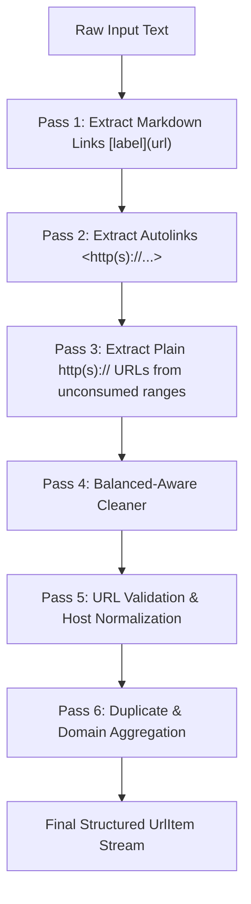

<div align="center">

# 🔗 Linkcount

### Paste links. See what is actually there.

A blazing-fast, privacy-first URL inspector, counter, filter, shortener, and exporter.<br/>
Accurately dissects complex pasted text and Markdown without ever mutating your source list.

[](https://react.dev/)
[](https://www.typescriptlang.org/)
[](https://vite.dev/)
[](https://tailwindcss.com/)
[](https://vitest.dev/)
[](https://motion.dev/)

[✨ Key Features](#-key-features) •
[🔄 Parser Pipeline](#-parser-pipeline) •
[⚡ URL Shortener](#-multi-provider-url-shortener) •
[🚀 Quick Start](#-quick-start) •
[📁 Project Structure](#-project-structure) •
[🇹🇭 สรุปภาษาไทย](#-สรุปภาษาไทย)

</div>

---

## 🖥️ Preview & Interface

```text
┌──────────────────────────────────────────────────────────────────────────────────┐
│  🔗 Linkcount    URL utility, without the clutter           [ ☀️ / 🌙 ] [ GitHub ]│
├──────────────────────────────────────────────────────────────────────────────────┤
│                                                                                  │
│   Analyze URLs                                                                   │
│   Paste links. See what is actually there.                                       │
│                                                                                  │
│  ┌──────────────────────────────────────────────┐  ┌──────────────────────────┐  │
│  │ URLs or text containing URLs                 │  │ TOTAL URLS            42 │  │
│  │                                              │  ├──────────────────────────┤  │
│  │  https://github.com/kainapat/url-link-counter│  │ UNIQUE                38 │  │
│  │  [Documentation](https://vite.dev/guide/)    │  ├──────────────────────────┤  │
│  │  Check out: <https://tailwindcss.com>        │  │ DUPLICATES             4 │  │
│  │                                              │  ├──────────────────────────┤  │
│  │                                              │  │ DOMAINS               12 │  │
│  │                                              │  ├──────────────────────────┤  │
│  │ [Clear]        Duplicate links are badged.   │  │ INVALID                0 │  │
│  └──────────────────────────────────────────────┘  └──────────────────────────┘  │
│                                                                                  │
│  ┌─ Domains ──────────────────────────────────────────────────────────────────┐  │
│  │  github.com (18)  •  vite.dev (8)  •  tailwindcss.com (6)   [Show all...]   │  │
│  └────────────────────────────────────────────────────────────────────────────┘  │
│                                                                                  │
│  ┌─ Results (42 links) ───────────────── [ Search URLs... ] [ Filter: All ▾ ] ┐  │
│  │  [📋 Copy all]  [📥 TXT]  [📊 CSV]  [✂️ Shorten all]  [📋 Copy shortened (38)] │  │
│  ├────────────────────────────────────────────────────────────────────────────┤  │
│  │  #1  https://github.com/kainapat...    github.com     [Valid]   [📋] [✂️]    │  │
│  │  #2  https://github.com/kainapat...    github.com     [Valid] [Duplicate]    │  │
│  │  #3  https://en.wikipedia.org/wiki/URL_(disambiguation)                      │  │
│  └────────────────────────────────────────────────────────────────────────────┘  │
└──────────────────────────────────────────────────────────────────────────────────┘
```

---

## ✨ Key Features

### 🔍 Precision URL Extraction
- **Markdown Link Support**: Automatically parses `[label](https://destination.com)` and extracts **only** the destination URL, preventing label text from corrupting link statistics.
- **Autolink Parsing**: Correctly extracts Markdown autolinks enclosed in brackets like `<https://example.com>`.
- **Balanced Wrapper Stripping**: Safely un-wraps prose punctuation like `(https://example.com)` or `"https://example.com"`, while intelligently keeping balanced parentheses intact (e.g. `https://en.wikipedia.org/wiki/Link_(film)`).
- **Zero Hallucinations**: Scheme-strict matching (`http://` and `https://` only). Scheme-less words, email addresses, and invalid syntax are never guessed or rewritten.
- **Document Order Preserved**: Retains the exact appearance order from the original text.

### 📊 Real-Time Analytics & Filtering
- **Reactive Stat Cards**: Instant feedback for **Total URLs**, **Unique**, **Duplicates**, **Domains**, and **Invalid** URLs.
- **Per-Domain Breakdown**: Displays top 5 domains with instant count pills + expandable drawer for the rest. Click any domain to immediately filter the result list.
- **Instant Search & Type Filter**: Fast client-side search across URLs and domains, plus dropdown filters (`All`, `Valid`, `Invalid`, `Duplicate`).
- **Non-Destructive Integrity**: Duplicate links are prominently badged in amber—**never silently discarded or mutated**.

### ⚡ Multi-Provider Resilient Shortener
- **Triple-Fallback Queue**: Requests flow through **TinyURL** ➔ **da.gd** ➔ **is.gd**. If CORS or rate-limits block one provider, it seamlessly cascades to the next.
- **Controlled Concurrency**: Limits network traffic to a max of **5 concurrent requests** (`SHORTEN_CONCURRENCY = 5`), preventing browser resource exhaustion.
- **Failure Isolation**: An error on one URL never breaks the batch. Each link independently tracks `waiting` ➔ `shortening` ➔ `done` / `failed`.
- **Accessible Live Progress**: Displays dynamic visual counts (`Shortening 14/50`) paired with an `aria-live="polite"` screen-reader announcer.

### 💾 Export & Clipboard
- **Universal Clipboard**: Copy any individual URL, copy all original links, or copy all successfully shortened links in one click (includes automatic textarea fallback for restricted browser environments).
- **CSV Export**: Formatted with standard comma separation, cell quotation, and **UTF-8 BOM** (`\uFEFF`) for perfect display in Microsoft Excel, Numbers, and Google Sheets.
- **TXT Export**: Clean, newline-delimited list ready for terminal scripts or batch downloaders.

### 🎨 Modern UI & Accessibility
- **Theming**: Dark and Light themes with fluid transitions; persists in `localStorage` and automatically syncs with system preference (`prefers-color-scheme`).
- **Smooth Micro-Interactions**: Powered by `motion/react` spring physics, fully respecting `prefers-reduced-motion: reduce`.
- **Radix UI Tooltips**: Accessible tooltips on action buttons with keyboard focus rings.
- **Mobile First**: Fully responsive layout from 320px screens to ultra-wide displays with touch targets ≥ 44px.

---

## 🔄 Parser Pipeline

Linkcount uses a deterministic, multi-stage parser engine (`src/lib/urls.ts`):



### Parsing Rules & Edge Cases

| Input Text | Resulting URL | Note |
|---|---|---|
| `[Homepage](https://github.com)` | `https://github.com` | Destination only; label discarded |
| `[https://a.com](https://a.com)` | `https://a.com` | Counted once (not double-counted) |
| `<https://vite.dev>` | `https://vite.dev` | Markdown autolink wrapper stripped |
| `(https://example.com)` | `https://example.com` | Prose parens cleanly stripped |
| `https://en.wikipedia.org/wiki/Link_(film)` | `https://en.wikipedia.org/wiki/Link_(film)` | Balanced parens preserved |
| `https://example.com/search?q=a,b&page=1` | `https://example.com/search?q=a,b&page=1` | Query strings and commas preserved |
| `Visit example.com today` | *(ignored)* | Scheme-less text is never guessed |

> 🛡️ **Cleaner Invariant**: Linkcount never unconditionally strips `; : ! ?`, never decodes or re-encodes query components, never trims trailing slashes, and never alters `http` ↔ `https`.

---

## ⚡ Multi-Provider URL Shortener

Network requests are managed by an asynchronous worker pool with automatic retry fallbacks (`src/lib/shorten.ts`):

```text
 ┌────────────────┐
 │  Link to Short │
 └───────┬────────┘
         │
         ▼
 ┌───────────────┐      CORS / Error
 │   TinyURL     ├──────────────────────┐
 └───────┬───────┘                      │
         │ HTTP 200                     ▼
         │                      ┌───────────────┐      CORS / Error
         │                      │     da.gd     ├─────────────────────┐
         │                      └───────┬───────┘                     │
         │                              │ HTTP 200                    ▼
         │                              │                     ┌───────────────┐
         │                              │                     │     is.gd     │
         ▼                              ▼                     └───────┬───────┘
 ┌─────────────────────────────────────────────────────────────┐      │ HTTP 200
 │                  Shortened URL Verified                     │◄─────┘
 └─────────────────────────────────────────────────────────────┘
```

- **TinyURL**: Primary shortener service.
- **da.gd**: Primary CORS-enabled fallback (`Access-Control-Allow-Origin: *`).
- **is.gd**: High-reliability secondary fallback.
- **Concurrency**: Processed in chunks of 5 simultaneous requests with cancellation support.

---

## 🛠️ Tech Stack

| Category | Technology | Purpose |
|---|---|---|
| **Core** | [React 18](https://react.dev/) | Component architecture & declarative state |
| **Language** | [TypeScript 5](https://www.typescriptlang.org/) | Strict typing, robust parser models |
| **Build Tool** | [Vite 6](https://vite.dev/) | Lightning-fast HMR and optimized production bundles |
| **Styling** | [Tailwind CSS 3](https://tailwindcss.com/) | Responsive design & dark mode utility classes |
| **Animation** | [Motion](https://motion.dev/) | Spring transitions with reduced-motion support |
| **Icons** | [Lucide React](https://lucide.dev/) | Clean, accessible SVG iconography |
| **Primitives** | [Radix UI Tooltip](https://www.radix-ui.com/) | WAI-ARIA compliant accessible tooltips |
| **Testing** | [Vitest](https://vitest.dev/) | 22 comprehensive unit & concurrency tests |

---

## 🚀 Quick Start

### Prerequisites
- **Node.js** (v18.0.0 or higher recommended)
- **npm** or your preferred package manager (`pnpm`, `bun`, `yarn`)

### Installation

```bash
# Clone the repository
git clone https://github.com/kainapat/url-link-counter.git

# Enter the directory
cd url-link-counter

# Install dependencies
npm install
```

### Development

```bash
# Start local development server (with HMR)
npm run dev
```

Open [http://localhost:5173](http://localhost:5173) in your browser.

### Testing

```bash
# Run Vitest test suite
npm run test
```

### Production Build

```bash
# Typecheck & build production bundle into dist/
npm run build

# Preview the production build locally
npm run preview
```

---

## 📁 Project Structure

```text
url-link-counter/
├── src/
│   ├── lib/
│   │   ├── urls.ts           # Parser pipeline, cleaner & domain counter
│   │   ├── urls.test.ts      # 19 parser unit tests (parens, markdown, edge cases)
│   │   ├── shorten.ts        # Multi-provider fallback shortener & batch queue
│   │   └── shorten.test.ts   # Concurrency, timeout & isolation tests
│   ├── App.tsx               # Main UI: input, analytics, results, bulk actions
│   ├── main.tsx              # Application entrypoint & MotionConfig setup
│   ├── index.css             # Tailwind base styles, theme variables, grid & glow
│   └── vite-env.d.ts         # Vite environment types
├── package.json              # Project scripts & dependencies
├── tailwind.config.js        # Tailwind configuration (dark mode, typography)
├── tsconfig.json             # TypeScript compiler settings
└── vite.config.ts            # Vite & Vitest configuration
```

---

## 🌿 Git Branch

Active development is maintained on the **`Chatgpt`** branch of [`kainapat/url-link-counter`](https://github.com/kainapat/url-link-counter).

```bash
# Switch to the development branch
git checkout Chatgpt
```

---

## 🇹🇭 สรุปภาษาไทย

**Linkcount** คือเว็บแอปพลิเคชันสำหรับวิเคราะห์ ตรวจนับ คัดกรอง ย่อลิงก์ และส่งออก URL จากข้อความใดๆ ได้อย่างแม่นยำ รวดเร็ว และปลอดภัย โดยทำงานบนเบราว์เซอร์ 100% ไม่มีการบันทึกหรือเปลี่ยนแปลงข้อความต้นฉบับของคุณ

### จุดเด่นที่สำคัญ
1. **แกะและแยกแยะ URL แม่นยำสูง (Precision Parser)**
   - รองรับรูปแบบ Markdown: `[ข้อความ](https://target.com)` โดยจะนับเฉพาะ URL ปลายทางเท่านั้น
   - รองรับ Autolink ในรูปแบบ `<https://example.com>`
   - ตัดเครื่องหมายวรรคตอนภายนอกอัตโนมัติ เช่น `(https://example.com)` หรือ `"https://example.com"` โดยยังคงรักษาวงเล็บที่เป็นส่วนหนึ่งของ URL ไว้ได้สมบูรณ์ (เช่น ลิงก์ Wikipedia)
   - ไม่มีการเดา URL ที่ไม่มี scheme (`http://` หรือ `https://`) เพื่อป้องกันข้อมูลผิดพลาด

2. **สถิติและการวิเคราะห์ทันที (Real-Time Stats)**
   - สรุปตัวเลขอัตโนมัติ: ลิงก์ทั้งหมด (Total), ลิงก์ที่ไม่ซ้ำ (Unique), ลิงก์ซ้ำ (Duplicates), จำนวนโดเมน (Domains) และลิงก์ที่ไม่ถูกต้อง (Invalid)
   - สรุปโดเมนยอดนิยม 5 อันดับแรก พร้อมปุ่มเปิดดูโดเมนทั้งหมด และคลิกเพื่อค้นหาได้ทันที
   - ค้นหา (Search) และกรอง (Filter) ตามสถานะ: ทั้งหมด / ใช้ได้ / ไม่ถูกต้อง / ลิงก์ซ้ำ

3. **ระบบย่อลิงก์อัจฉริยะ (Multi-Provider Shortener)**
   - ทำงานแบบ Fallback อัตโนมัติ: **TinyURL** ➔ **da.gd** ➔ **is.gd**
   - ควบคุมการส่งคำขอพร้อมกันสูงสุด 5 คำขอ (`concurrency: 5`) ไม่ทำให้เบราว์เซอร์ค้าง
   - หากมีลิงก์ใดย่อไม่สำเร็จ ลิงก์อื่นในชุดจะยังทำงานต่อได้ตามปกติ ไม่หยุดชะงัก
   - ดูความคืบหน้าแบบสด (เช่น `Shortening 14/50`) และคัดลอกลิงก์ที่ย่อแล้วทั้งหมดได้ในคลิกเดียว

4. **การส่งออกและคัดลอก (Export & Copy)**
   - คัดลอกแบบแยกรายแถว หรือคัดลอกทั้งหมด
   - ส่งออกเป็นไฟล์ **CSV** (พร้อม UTF-8 BOM สำหรับเปิดใน Excel ได้ภาษาไทยไม่เพี้ยน) และไฟล์ข้อความ **TXT**

5. **ดีไซน์สวยงามและเข้าถึงง่าย (UI & Accessibility)**
   - รองรับโหมดมืด (Dark Mode) และโหมดสว่าง (Light Mode) จดจำค่าผ่าน `localStorage`
   - แอนิเมชันลื่นไหลด้วย `Motion` พร้อมรองรับ `prefers-reduced-motion`
   - ใช้งานได้ดีทั้งบนมือถือและคอมพิวเตอร์ รองรับการควบคุมผ่านคีย์บอร์ด

---

## 📄 License

Open-source under the [MIT License](LICENSE).
